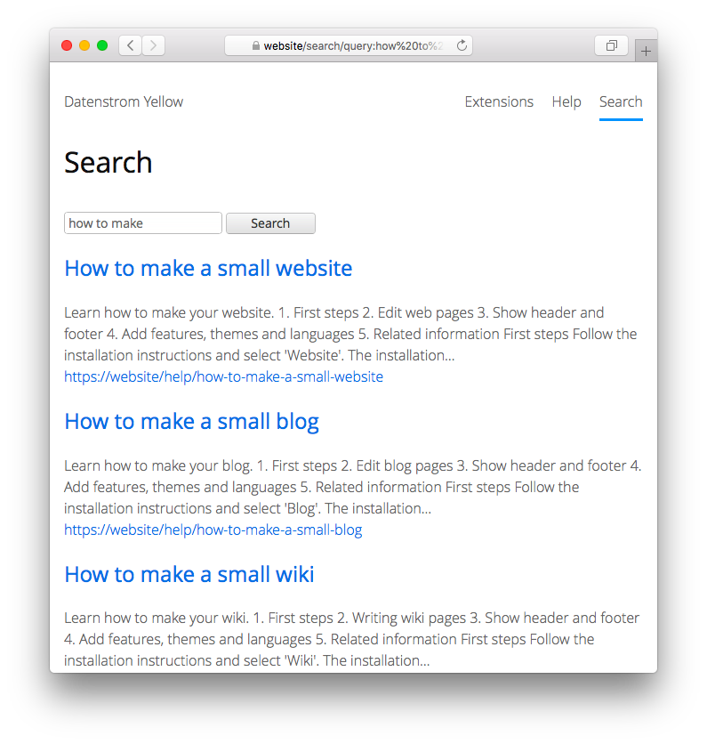

<a href="README-de.md">Deutsch</a> &nbsp; <a href="README.md">English</a> &nbsp; <a href="README-sv.md">Svenska</a>

# Search 0.9.1

Heltekstsökning.

## Hur man installerar ett tillägg

[Ladda ner ZIP-filen](https://github.com/annaesvensson/yellow-search/archive/refs/heads/main.zip) och kopiera den till din `system/extensions` mapp. [Läs mer om tillägg](https://github.com/annaesvensson/yellow-update/tree/main/README-sv.md).

## Hur man använder en sökning

Sökningen är tillgänglig på din webbplats som `http://website/search/`. Den söker igenom innehållet på hela webbplatsen, endast synliga sidor ingår. För att visa ett sökfält på din webbplats, lägg till en `[search]` förkortning.

Om du inte vill att en sida ska synas, ställ in `Status: unlisted` i [sidinställningar](https://github.com/annaesvensson/yellow-core/tree/main/README-sv.md#inställningar-page) högst upp på en sida.

## Hur man anpassar en sökning

Om du inte vill söka igenom hela webbplatsen, kan du använda olika filter för att anpassa sökresultaten. Filtret `author:` hittar sidor av en specifik författare. Filtret `language:` hittar sidor på ett specifikt språk. Filtret `tag:` hittar sidor med en specifik tagg. Filtret `folder:` hittar sidor i en specifik mapp. När du är inloggad med ditt användarkonto kan du söka med filtret `status:` efter [dolda sidor](https://github.com/annaesvensson/yellow-core/tree/main/README-sv.md) och [draftsidor](https://github.com/annaesvensson/yellow-draft/tree/main/README-sv.md).

## Exempel

Söka på en webbplats:

    kaffe
    mjölk socker 
    "mjölk och socker"

Söka på en webbplats, olika filter:

    kaffe author:datenstrom
    kaffe language:sv
    kaffe tag:exempel
    kaffe folder:help

Söka på en webbplats, ytterligare filter för inloggade användare:

    status:private
    status:draft
    status:unlisted
    status:shared
    status:all

Visa ett sökfält:

    [search]
    [search /search/]
    [search /sv/search/]

Innehållsfil med sökfält:

    ---
    Title: Exempelsida
    ---
    Lorem ipsum dolor sit amet, consectetur adipisicing elit, sed do eiusmod tempor incididunt ut 
    labore et dolore magna pizza. Ut enim ad minim veniam, quis nostrud exercitation ullamco laboris 
    nisi ut aliquip ex ea commodo consequat. Duis aute irure dolor in reprehenderit in voluptate velit 
    esse cillum dolore eu fugiat nulla pariatur. Excepteur sint occaecat cupidatat non proident, sunt 
    in culpa qui officia deserunt mollit anim id est laborum.

    [search]

Innehållsfil med länk till sökningen:

    ---
    Title: Exempelsida
    ---
    Lorem ipsum dolor sit amet, consectetur adipisicing elit, sed do eiusmod tempor incididunt ut 
    labore et dolore magna pizza. Ut enim ad minim veniam, quis nostrud exercitation ullamco laboris 
    nisi ut aliquip ex ea commodo consequat. Duis aute irure dolor in reprehenderit in voluptate velit 
    esse cillum dolore eu fugiat nulla pariatur. Excepteur sint occaecat cupidatat non proident, sunt 
    in culpa qui officia deserunt mollit anim id est laborum.

    [Sök på alla sidor](/search/).

Innehållsfil med länk till sökningen, senaste ändringarna på webbplatsen:

    ---
    Title: Exempelsida
    ---
    Lorem ipsum dolor sit amet, consectetur adipisicing elit, sed do eiusmod tempor incididunt ut 
    labore et dolore magna pizza. Ut enim ad minim veniam, quis nostrud exercitation ullamco laboris 
    nisi ut aliquip ex ea commodo consequat. Duis aute irure dolor in reprehenderit in voluptate velit 
    esse cillum dolore eu fugiat nulla pariatur. Excepteur sint occaecat cupidatat non proident, sunt 
    in culpa qui officia deserunt mollit anim id est laborum.
    
    [Se senaste ändringarna](/search/special:changes/).

Innehållsfil med olistad sida:

    ---
    Title: Olistad sida
    Status: unlisted
    ---
    Den här sidan är inte synlig i sökresultaten.

## Inställningar

Följande inställningar kan konfigureras i filen `system/extensions/yellow-system.ini`:

`SearchLocation` = plats för sökningen  
`SearchPaginationLimit` = antal inlägg att visa per sida, 0 för obegränsad  
`SearchPageLength` = maximal sidlängd att visa  

Följande filer kan anpassas:

`system/layouts/search.html` = layoutfil för sökningen  

## Utvecklare

Anna Svensson. [Få hjälp](https://datenstrom.se/sv/yellow/help/).
